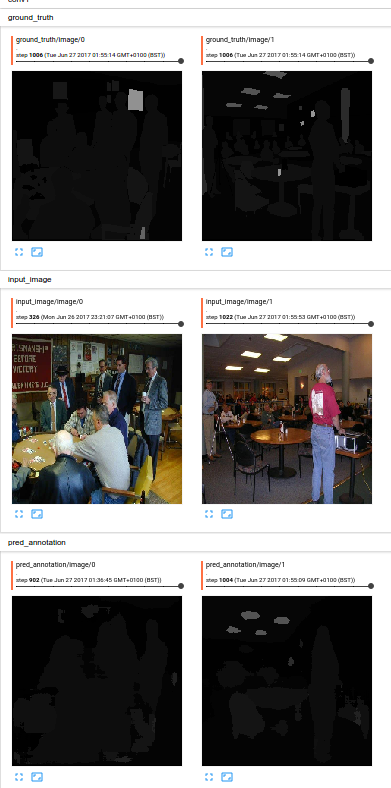

# Semantic Segmentation
Implement most common semantic segmentation algorithms. 
* FCN
* Deconvet
* Segnet

The idea is to give a clean code as reference, and have fun implementing those papers.

### Example

#### After 6h of training (cherrypicked result epoch 32)

### Reference Papers
* [Fully Convolutional Networks for Semantic Segmentation](https://arxiv.org/pdf/1411.4038.pdf)
* [Learning Deconvolution Network for Semantic Segmentation](https://arxiv.org/pdf/1505.04366.pdf)
* [SegNet: A Deep Convolutional
Encoder-Decoder Architecture for Image
Segmentation](https://arxiv.org/pdf/1511.00561.pdf)
* [ENet: A Deep Neural Network Architecture for
Real-Time Semantic Segmentation](https://arxiv.org/pdf/1606.02147.pdf)
* [Playing for Data: Ground Truth from Computer Games](https://arxiv.org/pdf/1608.02192.pdf)

### Frameworks used
* [Tensorflow 1.2](https://www.tensorflow.org/)
* [Pytorch](http://pytorch.org/)

### Datasets
* [Virtual KITTI dataset](http://www.xrce.xerox.com/Our-Research/Computer-Vision/Proxy-Virtual-Worlds)
* [MSCOCO](http://mscoco.org/home/)
* [MIT Scene Parsing Benchmark](http://sceneparsing.csail.mit.edu/)
* [MIT Scene Parsing Development Kit](https://github.com/CSAILVision/sceneparsing)
* [Cambridge Camsec](http://mi.eng.cam.ac.uk/research/projects/VideoRec/CamSeq01/)

### References
* [Semantic Segmentation chapter](https://leonardoaraujosantos.gitbooks.io/artificial-inteligence/content/image_segmentation.html)
* [CS231n 2016 Lecture 13](https://www.youtube.com/watch?v=ByjaPdWXKJ4)
* [Pixelwise semantic labelling using deep networks](https://www.youtube.com/watch?v=1oXjVyrIaxg)
* [Datageeks Data Day - Semantic Segmentation](https://www.youtube.com/watch?v=kgXc-XTyu-w)
* [Fully Convolutional Networks for Semantic Segmentation talk](http://techtalks.tv/talks/fully-convolutional-networks-for-semantic-segmentation/61606/)
* [Python Fire](https://github.com/google/python-fire/blob/master/doc/guide.md)
* [Conditional Random Field](https://en.wikipedia.org/wiki/Conditional_random_field)

### Reference Projects
* [FCN on tensorflow](https://github.com/shekkizh/FCN.tensorflow)
* [Enet Pytorch](https://gist.github.com/ndronen/19154831c2049a69e8d53dea8cf3e744)
* [Segnet Tensorflow](https://github.com/andreaazzini/segnet)
* [Deconvnet Tensorflow](https://github.com/fabianbormann/Tensorflow-DeconvNet-Segmentation)
* [FCN, Segnet, UNet on Pytorch](https://github.com/bodokaiser/piwise)
* [Pytorch for Semantic Segmentation](https://github.com/ycszen/pytorch-ss)
