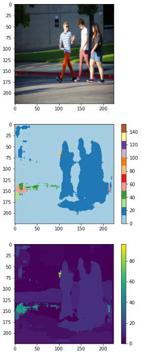
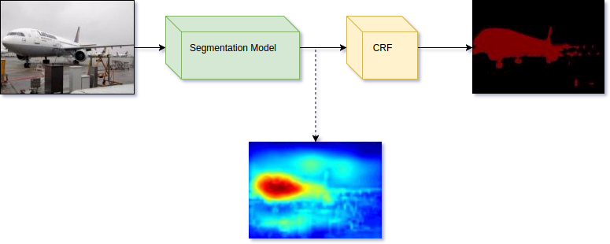

# Semantic Segmentation
Semantic Segmentation it's basically about segmenting images based on the object types that composes the image.

### What I plan to do
Implement most common semantic segmentation algorithms. 
* FCN
* Deconvet
* Segnet

The idea is to give a clean code as reference, and have fun implementing those papers.

### Example

#### After 24h of training (Example from internet)


### Reference Papers
* [Fully Convolutional Networks for Semantic Segmentation](https://arxiv.org/pdf/1411.4038.pdf)
* [Learning Deconvolution Network for Semantic Segmentation](https://arxiv.org/pdf/1505.04366.pdf)
* [SegNet: A Deep Convolutional
Encoder-Decoder Architecture for Image
Segmentation](https://arxiv.org/pdf/1511.00561.pdf)
* [ENet: A Deep Neural Network Architecture for
Real-Time Semantic Segmentation](https://arxiv.org/pdf/1606.02147.pdf)
* [Playing for Data: Ground Truth from Computer Games](https://arxiv.org/pdf/1608.02192.pdf)

### Spatial Loss
Basically is a softmax that runs on each pixel of your output tensor

```python
with tf.name_scope("SPATIAL_SOFTMAX"):
  loss = tf.reduce_mean((tf.nn.sparse_softmax_cross_entropy_with_logits(
    logits=model_out,labels=tf.squeeze(labels_in, squeeze_dims=[3]),name="spatial_softmax")))
```

### Improving results
One technique to improve the "bublish" effect from the segmentation network is to use Conditional Random Fields as a post-processing stage, which refines our segmentation by taking into account pure RGB features of image and probabilities produced by our network.


### Testing
Just download [this checkpoint compressed file](https://drive.google.com/open?id=0B2RH2qnlKMlEeTBmQnQ2RHVOaEU), extract somewhere and change on the [testing notebook](https://github.com/leonardoaraujosantos/LearnSegmentation/blob/master/src/notebooks/Tensorflow_Segmentation.ipynb) the checkpoint path.

### Training
First create your dataset, using the provided notebooks at __./src/notebook__, I will add one example for the most common datasets. Then to actually start your training use:

```bash
python train.py train --input=/dataset_lmdb --gpu=0 --mem_frac=0.8 --learning_rate_init=0.001
```

### Frameworks used
* [Tensorflow 1.2](https://www.tensorflow.org/)
* [Pytorch](http://pytorch.org/)

### Datasets
* [Virtual KITTI dataset](http://www.xrce.xerox.com/Our-Research/Computer-Vision/Proxy-Virtual-Worlds)
* [MSCOCO](http://mscoco.org/home/)
* [MIT Scene Parsing Benchmark](http://sceneparsing.csail.mit.edu/)
* [MIT Scene Parsing Development Kit](https://github.com/CSAILVision/sceneparsing)
* [Cambridge Camsec](http://mi.eng.cam.ac.uk/research/projects/VideoRec/CamSeq01/)

### References
* [Semantic Segmentation chapter](https://leonardoaraujosantos.gitbooks.io/artificial-inteligence/content/image_segmentation.html)
* [CS231n 2016 Lecture 13](https://www.youtube.com/watch?v=ByjaPdWXKJ4)
* [Pixelwise semantic labelling using deep networks](https://www.youtube.com/watch?v=1oXjVyrIaxg)
* [Datageeks Data Day - Semantic Segmentation](https://www.youtube.com/watch?v=kgXc-XTyu-w)
* [Fully Convolutional Networks for Semantic Segmentation talk](http://techtalks.tv/talks/fully-convolutional-networks-for-semantic-segmentation/61606/)
* [Python Fire](https://github.com/google/python-fire/blob/master/doc/guide.md)
* [Conditional Random Field](https://en.wikipedia.org/wiki/Conditional_random_field)
* [Conditional Random Field Presentation](http://www.robots.ox.ac.uk/~davidc/pubs/crfs_jan2015.pdf)
* [Deep Convolutional Neural Fields for Depth Estimation from a Single Image](http://www.cv-foundation.org/openaccess/content_cvpr_2015/papers/Liu_Deep_Convolutional_Neural_2015_CVPR_paper.pdf)

### Reference Projects
* [FCN on tensorflow](https://github.com/shekkizh/FCN.tensorflow)
* [Enet Pytorch](https://gist.github.com/ndronen/19154831c2049a69e8d53dea8cf3e744)
* [Segnet Tensorflow](https://github.com/andreaazzini/segnet)
* [Deconvnet Tensorflow](https://github.com/fabianbormann/Tensorflow-DeconvNet-Segmentation)
* [FCN, Segnet, UNet on Pytorch](https://github.com/bodokaiser/piwise)
* [Pytorch for Semantic Segmentation](https://github.com/ycszen/pytorch-ss)
* [Caffe original Segnet](https://github.com/alexgkendall/caffe-segnet)
* [Caffe original FCN](https://github.com/shelhamer/fcn.berkeleyvision.org)
* [FCN on tensorflow 2](https://github.com/xiaofanglegoc/tensorflow-fcn)
* [FCN on tensorflow 3](https://github.com/MarvinTeichmann/tensorflow-fcn)
* [Lung Cancer Segmentation](https://github.com/topcoderinc/Harvard-HMS-LC-MM1-Public)
* [Blog explanation](http://warmspringwinds.github.io/tensorflow/tf-slim/2017/01/23/fully-convolutional-networks-(fcns)-for-image-segmentation/)
* [Segmentation Hangout](https://github.com/handong1587/handong1587.github.io/blob/master/_posts/deep_learning/2015-10-09-segmentation.md)
* [Image Segmentation and CRF Notebook](https://github.com/warmspringwinds/tensorflow_notes/blob/master/image_segmentation_conditional_random_fields.ipynb)

### Some other references
* [Display custom images on Tensorboard](https://stackoverflow.com/questions/38543850/tensorflow-how-to-display-custom-images-in-tensorboard-e-g-matplotlib-plots)
