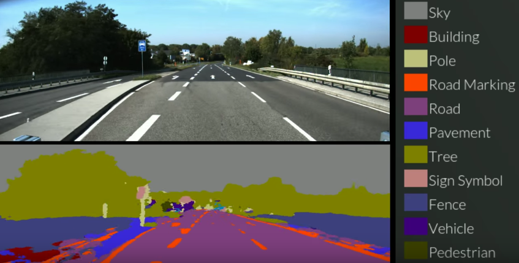

# Semantic Segmentation
Implement most common semantic segmentation algorithms. I will try my best to implement good reference code on the most comon deep learning frameworks.

### Example

### Reference Papers
* [Fully Convolutional Networks for Semantic Segmentation](https://people.eecs.berkeley.edu/~jonlong/long_shelhamer_fcn.pdf)
* [Learning Deconvolution Network for Semantic Segmentation](https://arxiv.org/pdf/1505.04366.pdf)
* [SegNet: A Deep Convolutional
Encoder-Decoder Architecture for Image
Segmentation](https://arxiv.org/pdf/1511.00561.pdf)

### Frameworks used
* [Tensorflow 1.2](https://www.tensorflow.org/)
* [Pytorch](http://pytorch.org/)

### Datasets
* [Virtual KITTI dataset](http://www.xrce.xerox.com/Our-Research/Computer-Vision/Proxy-Virtual-Worlds)
* [MSCOCO](http://mscoco.org/home/)

### References
* [Semantic Segmentation chapter](https://leonardoaraujosantos.gitbooks.io/artificial-inteligence/content/image_segmentation.html)
* [CS231n 2016 Lecture 13](https://www.youtube.com/watch?v=ByjaPdWXKJ4)
* [Pixelwise semantic labelling using deep networks](https://www.youtube.com/watch?v=1oXjVyrIaxg)
* [Datageeks Data Day - Semantic Segmentation](https://www.youtube.com/watch?v=kgXc-XTyu-w)
